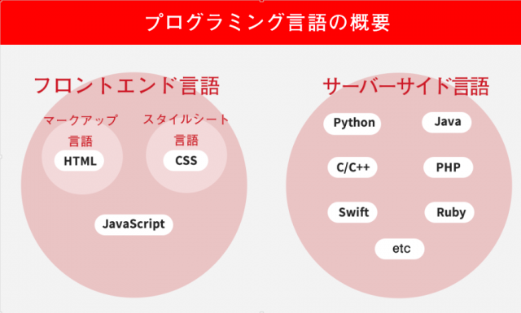

# Gitの使い方マニュアル
## とりあえず今年本を100冊読む
**大体三日に一冊読み終わるペース**

技術書も読む。資格もうまく取っていこう。

- python
- azure

|概要 |内容
|--|--
|資料 |資料代 有料
|test |テスト
 

## 一日2単元
### 3段階目

とりあえず適当に書いた

また適当に書いた

別日

招待して承認したら
codeでデスクトップの方を開く

test
